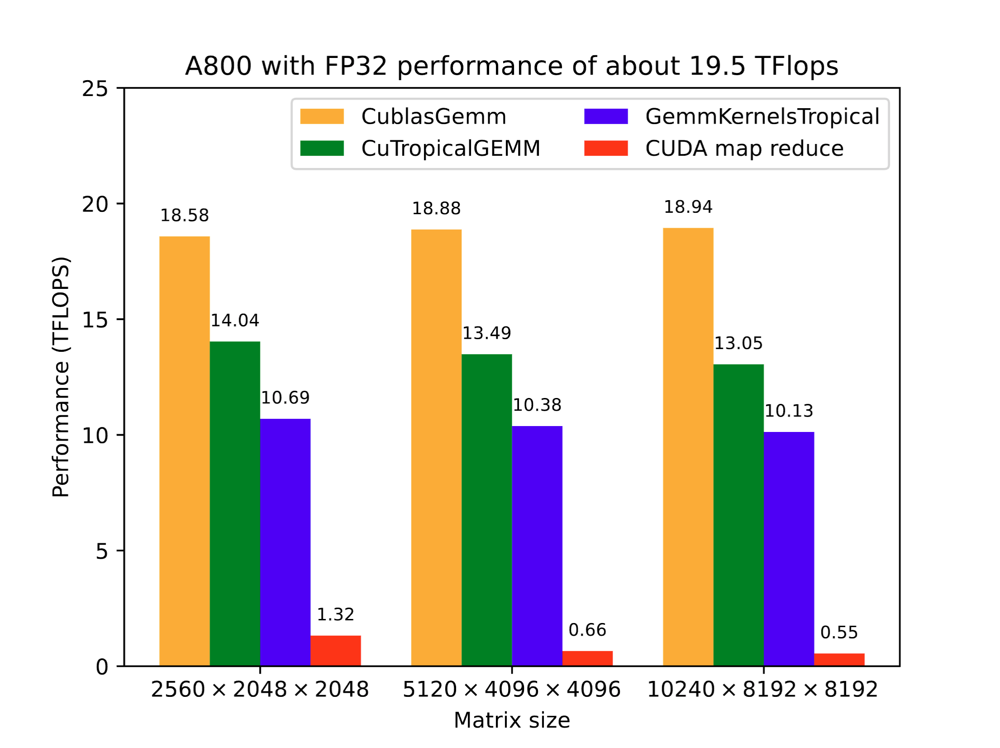
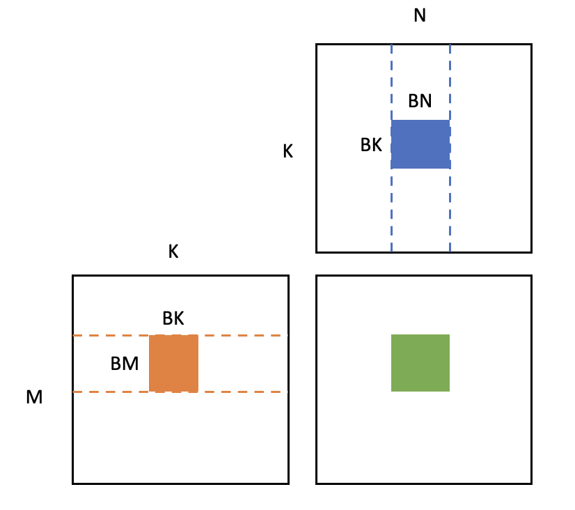
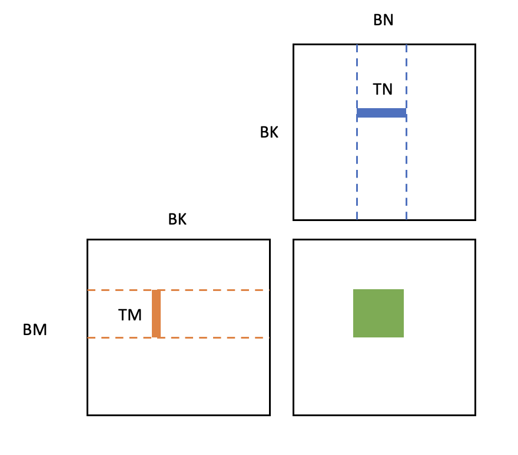

# How to implement generic matrix multiplication (GEMM) with generic element types on GPU?

After reading this blog, you will learn:

1. What is Tropical algebra? Why we need that?
2. What is `Julia` programing language and why it is useful?
3. Why GPU is fast and how to implement a fast generic matrix multiplication on Nvidia GPU?
4. How to join the [Open Source Promotion Plan](https://summer-ospp.ac.cn/)?

This blog is a technical note for the [Open Source Promotion Plan 2023](https://summer-ospp.ac.cn/) project ["TropicalGEMM on GPU"](https://summer-ospp.ac.cn/org/prodetail/23fec0105?lang=en&list=pro) relesed by JuliaCN, where I developed a [Julia](https://julialang.org/) package [CuTropicalGemm.jl](github.com/TensorBFS/CuTropicalGEMM.jl) calculate Generic Matrix Multiplication (GEMM) of Tropical Numbers on Nvidia GPUs.

## What is Tropical Algebra and why we need it?

[Tropical algebra](https://en.wikipedia.org/wiki/Tropical_geometry) is a set of [semiring algebra](https://en.wikipedia.org/wiki/Semiring), which is a generalization of a ring, dropping the requirement that each element must have an additive inverse.
Generally, they can be defined as a set $R$ equipped with two binary operations $\oplus$ and $\otimes$, called addition and multiplication, such that:

* $(R, \oplus)$ is a monoid with identity element called $\mathbb{0}$;
* $(R, \otimes)$ is a monoid with identity element called $\mathbb{1}$;
* Addition is commutative;
* Multiplication by the additive identity $\mathbb{0}$ annihilates ;
* Multiplication left- and right-distributes over addition;
* Explicitly stated, $(R, \oplus)$ is a commutative monoid.


A Topical algebra can be described as a tuple $(R, \oplus, \otimes, \mathbb{0}, \mathbb{1})$, where $R$ is the set, $\oplus$ and $\otimes$ are the opeartions and $\mathbb{0}$, $\mathbb{1}$ are their identity element, respectively. 
Here some commonly used algebras are listed below:
* `TropicalAndOr`: $([T, F], \lor, \land, F, T)$;
* `TropicalMaxPlus` (also simply called `Tropical`): $(\mathbb{R}, \max, +, -\infty, 0)$;
* `TropicalMinPlus`: $(\mathbb{R}, \min, +, \infty, 0)$;
* `TropicalMaxMul`: $(\mathbb{R}^+, \max, \times, 0, 1)$.

In recent years, the tropical numbers have been widely used in various areas, including optimization, physics, and computer science, due to its computational simplicity.

For example, it was shown that solving the groud state energy of spin glass problem can be mapped as contraction of a tropical tensor network, which is actually calculating tons of matrix multiplication of Tropical numbers, as shown in
* [arxiv: Tropical Tensor Network for Ground States of Spin Glasses](https://arxiv.org/abs/2008.06888)
* [Lei Wang: "Tropical Tensor Networks"](https://www.youtube.com/watch?v=l_7xZ4trcnE)

Although such reformulation did not actucally reduce the complexity of the problem, but in this way we can fully use the power of parallel computing technology developed in recent years and greatly speed up the computation.

Recently, it has also been considered to use the Tropical algebra in machine learning area, as shown in 

* [Generalizing Backpropagation for Gradient-Based Interpretability](https://arxiv.org/abs/2307.03056)
* [Torch-Struct: Deep Structured Prediction Library](https://arxiv.org/abs/2002.00876)

For these purposes, a fast implementation of the TropicalGEMM on GPU is on demand.

## Matrix Multiplication of Tropical Numbers on GPU

We achieved fast TropicalGEMM via two packages in `Julia`.
* [`TropicalNumbers.jl`](github.com/TensorBFS/TropicalNumbers.jl): an interface for Tropical Numbers, which will allow users to use tropical numbers just like normal numbers.
* [`CuTropicalGEMM.jl`](github.com/TensorBFS/CuTropicalGEMM.jl): a fast implementation of the TropicalGEMM on GPU, fast and easy to use.

In the following part of this section, we will mainly introduce these two packages.
Including how to use them and how we developed them.

### Julia Programing Language

As we mentioned above, we choose to use the `Julia` programing language, which is becoming more and more popular in the past few years.
Why we choose `Julia`?
Let's just copy something from the blog [*Why We Create Julia?*](https://julialang.org/blog/2012/02/why-we-created-julia/):

>We are greedy: we want more.
>
>We want a language that's open source, with a liberal license. We want the speed of C with the dynamism of Ruby. We want a language that's homoiconic, with true macros like Lisp, but with obvious, familiar mathematical notation like Matlab. We want something as usable for general programming as Python, as easy for statistics as R, as natural for string processing as Perl, as powerful for linear algebra as Matlab, as good at gluing programs together as the shell. Something that is dirt simple to learn, yet keeps the most serious hackers happy. We want it interactive and we want it compiled.

Briefly, `Julia` is fast, and easy to use.


### User Friendly Tropical Interface: `TropicalNumbers.jl`

For convenience, we want to use tropical number just like normal numbers willout lose of performance, so that we make use of the type system in `Julia`.

Type system of `Julia` allows us to create our own types, and `Julia` support multiple dispatch based on that.
For example, we can do the following things in `Julia`
```julia
julia> struct bird end

julia> struct dog end

julia> function fly(a::bird) return true end
fly (generic function with 1 method)

julia> function fly(a::dog) return false end
fly (generic function with 2 methods)

julia> bird_1 = bird(); dog_1 = dog();

julia> fly(bird_1)
true

julia> fly(dog_1)
false
```

Then we can simply define the Tropical number as a new number type, and overload the correspond operations.
That is what we do in package [TropicalNumbers.jl](github.com/TensorBFS/TropicalNumbers.jl).
```julia
abstract type AbstractSemiring <: Number end

struct Tropical{T} <: AbstractSemiring
    n::T

    Tropical{T}(x) where T = new{T}(T(x))
    function Tropical(x::T) where T
        new{T}(x)
    end
end

Base.:*(a::Tropical, b::Tropical) = Tropical(a.n + b.n)
Base.:+(a::Tropical, b::Tropical) = Tropical(max(a.n, b.n))
```
In that case, users can use the tropical algebra just like normal numbers, for example
```julia
julia> using TropicalNumbers

julia> a, b = Tropical(1.0), Tropical(2.0)
(1.0ₜ, 2.0ₜ)

julia> a + b, a * b
(2.0ₜ, 3.0ₜ)
```
and opeartions of vectors and matrices also work
```julia
julia> A = Tropical.(rand(2, 2))
2×2 Matrix{Tropical{Float64}}:
 0.2238665251106623ₜ  0.18355043791779635ₜ
 0.3673107532619566ₜ   0.1573950170887196ₜ

julia> B = Tropical.(rand(2))
2-element Vector{Tropical{Float64}}:
 0.16479545470285972ₜ
  0.3666513822212566ₜ

julia> A * B
2-element Vector{Tropical{Float64}}:
 0.5502018201390529ₜ
 0.5321062079648163ₜ
```
Since we define the tropical number as a subtype of `Number`,
```julia
julia> isbitstype(Tropical{Float64})
true
```
which means the storage of an array of tropical numbers in the memory is continium, just like normal numbers.

We also implemented other Tropical algebra, you can use them like that:
```julia
julia> TropicalAndOr(true), TropicalMinPlus(1.0), TropicalMaxMul(1.0)
(trueₜ, 1.0ₛ, 1.0ₓ)
``` 

All these things work naturally, users will be able to use the tropical algebra just like real numbers.

### Fast TropicalGEMM on GPU: `CuTropicalGEMM.jl`

`CuTropicalGEMM.jl` is the package we developed to speed up the TropicalGEMM on Nvidia GPU.
In this package, we use `C-Cuda` directly for the lower level interface to achieve a high performace and then wrap the code with a `Julia` interface, so that it is easy to use.

Before further introduction, let me first show you a simple benchmark result on NVIDIA A800 80GB PCIe:

We compared the performance of `CuTropicalGEMM.jl`, [GemmKernels.jl](https://github.com/JuliaGPU/GemmKernels.jl) and direct CUDA.jl map reduce on Tropical GEMM with single precision.
The performance is defined as
$$
\frac{2 \times M \times K \times N}{T}\;,
$$
where $M$, $N$, $K$ are the size of the matrix so that $2MNK$ is the number of total operations in matrix multiplication, and $T$ is the time cost.
The performance of Cublas on normal GEMM is used as a reference of the maximum computing power.
Clearly, the result shows that the performance of our package is about $75\%$ of the theortical maximum, which is quite high since the tropical algebra can not use the fused multiple add (FMA) opeartions.

#### How to use this package?

`CuTropicalGEMM.jl` can be easily used, just like the `TropicalNumbers.jl`.
We fully used the multiple dispatch in `Julia` and overloaded the function `LinearAlgebra.mul!` for the types `CuVecOrMat{Tropical}`, which will be called when you use $*$ between these tropical vectors or matrices.

Here is an example:
```julia
julia> using CUDA, LinearAlgebra, TropicalNumbers, CuTropicalGEMM

julia> A = CuArray(Tropical.(rand(2,2)))
2×2 CuArray{Tropical{Float64}, 2, CUDA.Mem.DeviceBuffer}:
 0.5682481722270427ₜ  0.7835411877064771ₜ
 0.4228348375216514ₜ  0.9492658562534506ₜ

julia> B = CuArray(Tropical.(rand(2,2)))
2×2 CuArray{Tropical{Float64}, 2, CUDA.Mem.DeviceBuffer}:
 0.37361925746020586ₜ   0.6628092509923389ₜ
  0.3415957179381368ₜ  0.28749655890269377ₜ

julia> A * B
2×2 CuArray{Tropical{Float64}, 2, CUDA.Mem.DeviceBuffer}:
 1.1251369056446139ₜ  1.2310574232193816ₜ
 1.2908615741915874ₜ  1.2367624151561443ₜ
```
Or if you want to use a pre-allocate matrix $C$ or calculate $C + A \times B$, you can use:
```julia
julia> C = CuArray(Tropical.(zeros(2, 2)));

julia> mul!(C, A, B)
2×2 CuArray{Tropical{Float64}, 2, CUDA.Mem.DeviceBuffer}:
 1.1251369056446139ₜ  1.2310574232193816ₜ
 1.2908615741915874ₜ  1.2367624151561443ₜ
```

To benchmark the performance, you can use the `@benchmark` and `CUDA.@sync` marco.
```julia
julia> using CUDA, CuTropicalGEMM, TropicalNumbers

julia> A = TropicalF32.(CUDA.rand(4096, 4096));

julia> B = TropicalF32.(CUDA.rand(4096, 4096));

julia> @benchmark CUDA.@sync $(A) * $(B)
BenchmarkTools.Trial: 53 samples with 5 evaluations.
 Range (min … max):   6.691 μs …    1.574 s  ┊ GC (min … max): 0.00% … 0.00%
 Time  (median):      7.117 μs               ┊ GC (median):    0.00%
 Time  (mean ± σ):   29.701 ms ± 216.171 ms  ┊ GC (mean ± σ):  0.00% ± 0.00%

  █▅
  ██▅▃▃▄▃▁▁▁▁▁▁▁▁▁▁▁▁▁▁▁▁▁▁▁▁▁▁▁▁▁▁▁▁▁▁▁▁▁▁▁▁▁▁▁▁▁▁▁▁▁▁▁▁▁▁▁▁▃ ▁
  6.69 μs         Histogram: frequency by time         30.7 μs <

 Memory estimate: 256 bytes, allocs estimate: 7.
```
and what is important here is the `mean` time (currently there are some issues about the detection of time cost and we are still working on that).

You can also use that in more complicated cases, when developing you own package, by `using CuTropicalGEMM`, the `mul!` opeartions between Tropical matrices will be overloaded.
Here is an example to directly use this package to speed up the maximum independent set (MIS) problem.
```julia
julia> using GenericTensorNetworks, GenericTensorNetworks.Graphs, CUDA, Random

julia> g = Graphs.random_regular_graph(200, 3)
{200, 300} undirected simple Int64 graph

julia> item(x::AbstractArray) = Array(x)[];

julia> optimizer = TreeSA(ntrials=1);

julia> gp = IndependentSet(g; optimizer=optimizer);

julia> contraction_complexity(gp)
Time complexity: 2^30.519117443024154
Space complexity: 2^24.0
Read-write complexity: 2^27.24293120300714

julia> @time CUDA.@sync solve(gp, SizeMax(); usecuda=true, T=Float32)
 31.104404 seconds (48.07 M allocations: 3.239 GiB, 2.31% gc time, 88.25% compilation time: <1% of which was recompilation)
0-dimensional CuArray{Tropical{Float32}, 0, CUDA.Mem.DeviceBuffer}:
89.0ₜ

julia> using CuTropicalGEMM

julia> @time CUDA.@sync solve(gp, SizeMax(); usecuda=true, T=Float32)
  0.361831 seconds (440.99 k allocations: 28.131 MiB, 85.79% compilation time: 100% of which was recompilation)
0-dimensional CuArray{Tropical{Float32}, 0, CUDA.Mem.DeviceBuffer}:
89.0ₜ
```

#### Why it is fast?

Here we will breifly introduce the techniques we used to speed up our code, which are commonly used in GPU implementation of GEMM.
We learned a lot from the repo [CUDA_gemm](https://github.com/Cjkkkk/CUDA_gemm) by [Cjkkk](https://cjkkkk.github.io).
Here we will briefly introduce these techinques, and for more detailed introduction, I recommand this [blog](https://zhuanlan.zhihu.com/p/441146275) in Chinese.

As we all know, Nvidia GPU is fast because it have a large amount of cuda cores.
For example, the Nvidia A800 GPU have $6912$ cuda cores, which is much more larger than the number of CPU cores, which is normally less than $100$.
The peak flops of A800 is about~$19.5$T, which is also much higher than that of CPU, for example $0.5$T for an Intel i7-10700K.

However, each cuda core is much weaker than that of CPU, so that the developer will have to properly allocate the tasks to these cores so that can fully use them.
In a CUDA kernel, each cuda core is used by a *thread* and these *threads* are grouped as *blocks*.

Another imortant aspect is the memory of GPU, there are three type of programable memories on GPU:
* Global memory, shared by all blocks, large but slow.
* Shared memory, shared by threads in the same block, small but fast, just like a programable L1 cache.
* Registers, used by only one thread.

Driectly loading data from global memory will take a long time, the bandwidth is only about $1000$GB/s and the latency is about $600$ cycles on A800 GPU.
For shared memory, its bandwidth is about $20000$GB/s while the latency is only about $23$ cycles, so that another main target in GPU programing is to properly use the memory, avoid directly loading from the global memory and pre-load the needed data into the shared memory. 

GEMM is a very memory-intensive operation, for example, when calculating the GEMM between a $M \times K$ matrix and a $K \times N$ matrix, if we use the naive way, i.e. evaluating the element in the result matrix one by one, for each element we will have to load $2K$ data, and there are $M \times N$ elements in total.
Then we will have to load $2 \times M \times K \times N$ elements from the slow global memeory directly to registers in the whole process, and this generally far exceeds the data bandwidth of the GPU, resulting in serious performance issues.

To avoid the heavy data loading, we first split the target matrix blocks with size $BM \times BN$, and each GPU block will be used to calculate one of the matrix blocks, as shown in the fig below: 



When calculating each block, we only need to load matrices with size $BM \times BK$ and $BK \times BN$ for~$K / BK$ times from global memory to shared memory.
In that case, the total data loading will be reduce to 
$$
    M \times N \times K \times \left( \frac{1}{BM} + \frac{1}{BN} \right)
$$
which is much smaller than the naive way.

Then in each block, we further divide the matrix and use the registers to store the data, as shown by



The target matrix will be further divided as small matrices with size $TM \times TN$, and each thread will be used to calculate one of the matrix.
During this process, the outer product way is used and data will be loaded from shared memory to registers, with the amount of $(TM + TN) \times BK$ in total.
In our package, we set the parameters as
$$
    BM = 64,~BK = 32,~BN = 64,~TM = TN = 4.
$$

As we mentioned above, the `Tropical` type is `bitstype`, and the data storaged in memeories are simply the floating point numbers, which can be directly used by CUDA kernels.
Of course here we used the tropical algebra instead of the normal ones.
Although the tropical algebra can not use the fused multiple add core (FMA), we found that the operation add/mul and max/min can be done on FMA and ALU parallelly, which means that we can use the FMA to do the add/mul and ALU to do the max/min at the same time.
Then after all the calculation is done, the target in the registers will be stored back to global memory directly.

For the boundary elements, a padding strategy is used, we simply set the element which are not acctually in the matrix as the zero element of the corresponding algebra, so that they will not effect the result of the calculation.

#### Benchmark

Further benchmarking is still in development, and will be uoloaded to this repo [CuTropicalGEMM_benchmark](https://github.com/ArrogantGao/CuTropicalGEMM_benchmark).

### Optimization of Narrow Matrix Performance

The second aspect is to further optimize the code, especially the performance on narrow matrices.
As mentioned above, our package now is using the padding strategy to handle the boundary elements, and the minimum matrix size we process in each block on the GPU are $64 \times 32 \times 64$, which is optimal for large square matrices.
However, the performance of the code on narrow matrices is not good enough, and the reason is that the padding strategy will enlarge the matrix size a lot.
For example, when handling a matrix multiplication with size $4 \times 4 \times 10^6$, what is actually calculated is $64 \times 32 \times 10^6$, which means that the code will waste a lot of time on the padding elements.
Unfortunately, such narrow matrices are very common in the tensor network contraction process, and the performance of the code on narrow matrices is very important.

Now we are considering further optimize the code for narrow matrices, related code are stored in the branch [narrow matrices](https://github.com/TensorBFS/CuTropicalGEMM.jl/tree/narrow_matrices).

## Open Source Promotion Plan

As mentioned above, this program is support by [Open Source Promotion Plan 2023](https://summer-ospp.ac.cn/), JuliaCN.
>Open Source Promotion Plan is a summer program organized by the Institute of Software Chinese Academy of Sciences and long-term supported by the Open Source Software Supply Chain Promotion Plan. It aims to encourage college students to actively participate in the maintenance and development of open source software, promote the vigorous development of open source software communities, and build the open source software supply chain together.

I will recommend anyone who is interested in developing open source software to join this plan.
During the plan, the open source communities will release [projects](https://summer-ospp.ac.cn/org/orglist) and each participant can choose three projects to apply.
Once the application is approved, the participants can follow the mentor to complete the program in about three months.

I think it is a great chance to learn and to build connection with the community.

The plan starts in each summer, and the application commonly opens in June.
If interested, just go and join OSPP $2024$!

## Acknowledgement

I am very grateful for the guidance and assistance provided by Prof. [Jinguo Liu](https://github.com/GiggleLiu) during the project implementation process.
I would like to thank [Tim Besard](https://github.com/maleadt) for his invaluable guidance and support during the development of the package, his expertise in GPU utilization have been immensely helpful. 
I also want to thank [Tyler Thomas](https://github.com/tylerjthomas9) for his assistance in understanding the usage of BinaryBuilder.jl.

This program is support by [Open Source Promotion Plan 2023](https://summer-ospp.ac.cn/), JuliaCN.